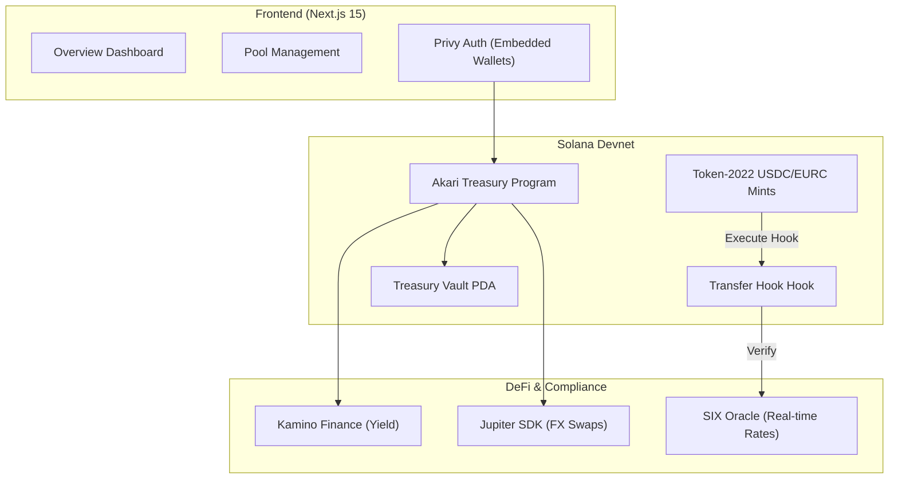

# <p align="center"><br/>Akari Treasury</p>

<p align="center">
  <b>The Next Institutional Treasury Standard on Solana</b><br/>
  <i>Yield-bearing liquidity, compliant FX swaps, and automated audit trails.</i>
</p>

---

## 💎 Overview

**Akari** (明かり - "Light/Illumination") is a high-performance treasury management protocol designed for institutional capital movement on the Solana blockchain. By integrating permissioned liquidity controls with world-class DeFi primitives, Akari enables global corporations to manage idle capital with full regulatory compliance and maximum efficiency.

Built for the **StableHacks** hackathon, Akari demonstrates a unified engine for corporate yield, compliant FX, and real-time travel rule enforcement.

## 🚀 Key Pillars

### 📊 Institutional DeFi Yield
Idle USDC and EURC are automatically routed to **Kamino Finance** reserve pools. Akari ensures that corporate capital works 24/7 without sacrifice to liquidity or safety.

### ⚡ Automated FX Swaps
Seamlessly swap between stablecoin pairs using the **Jupiter SDK**. Akari leverages global liquidity to provide the best possible execution for massive corporate treasury movements.

### 🛡️ Compliant Liquidity Engine
Akari utilizes **Token-2022 Transfer Hooks** to enforce strict compliance at the protocol level. Every transfer is validated against:
- **KYC/AML Merkle Roots**: Ensuring only verified entities can hold and transfer funds.
- **SIX Travel Rule**: Real-time validation of cross-border transfers via a specialized oracle relay.

### 🔎 Immutable Audit Trail
Every institutional action — from deposits to cross-currency swaps — is recorded as an immutable on-chain event, providing a transparent, verifiable history for regulators and internal auditors.

## 🏗️ Architecture



## 🛠️ Technical Stack

- **Smart Contracts**: [Anchor Framework](https://www.anchor-lang.com/) / Rust
- **Compliance**: SPL Token-2022 (Transfer Hooks)
- **Frontend**: [Next.js](https://nextjs.org/) + [Framer Motion](https://www.framer.com/motion/) + [TailwindCSS](https://tailwindcss.com/)
- **Authentication**: [Privy](https://www.privy.io/) (Social Login + Embedded Wallets)
- **Oracle Integration**: [SIX Digital Exchange](https://www.six-group.com/) (Price Feeds + Travel Rule Relays)
- **Yield/Liquidity**: [Kamino Finance](https://kamino.finance/) & [Jupiter](https://jup.ag/)

## 🏁 Quick Start

### 1. Prerequisites
- [Solana Tool Suite](https://docs.solana.com/cli/install-solana-cli-tools)
- [Anchor Version 0.30.1+](https://www.anchor-lang.com/docs/installation)
- Node.js 18+

### 2. Environment Setup
```bash
# Install dependencies
npm install
cd app && npm install && cd ..

# Setup local keys
solana-keygen new -o ~/.config/solana/id.json
# Ensure you are on devnet
solana config set --url devnet
```

### 3. Deploy & Simulate
To populate the Devnet environment with institutional data for testing:
```bash
# 1. Run simulation to create mints, registers, and populate history
npx ts-node scripts/simulate-transfers.ts

# 2. Start the oracle relays (Required for Audit Trail accuracy)
# Terminal 1:
node oracle-relay/dist/index.js
# Terminal 2 (Standby):
node oracle-relay/dist/standby.js
```

### 4. Launch Dashboard
```bash
cd app
npm run dev
# Open http://localhost:3000
```

## 🎥 Recording the Demo
The Akari demo includes a specific sequence to showcase the "Travel Rule" in action:
1.  **Identity**: Log in via Privy to access the institutional dashboard.
2.  **Audit**: Review the pre-populated activity feed of global subsidiary transfers.
3.  **Action**: Perform a deposit of USDC to see the **Transfer Hook** validation in real-time.
4.  **Enforcement**: Attempt a transfer that violates the Daily Limit — watch the Travel Rule trigger a soft-block until verified.

---

<p align="center">
  Built with 🧡 for StableHacks 2024.<br/>
  <b>Akari: Automating the Future of Corporate Finance.</b>
</p>
